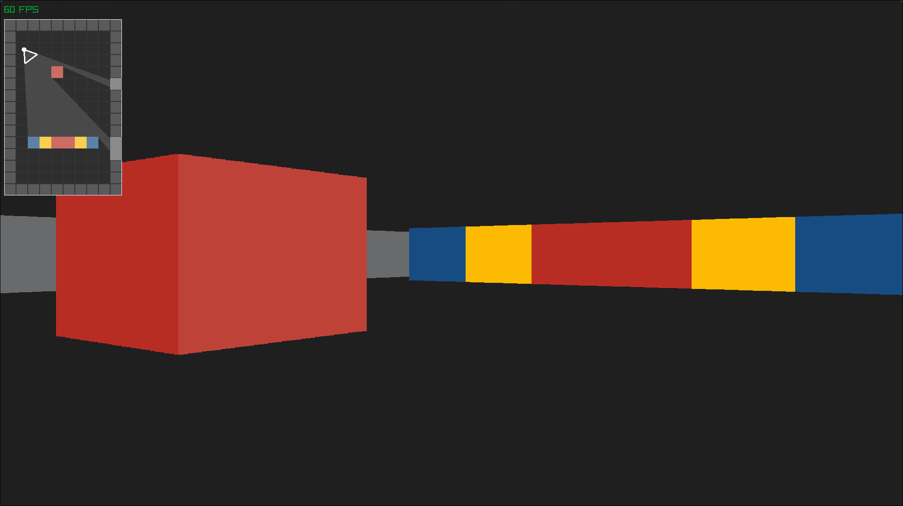

# Raycasting

An attempt to implement old-school "3D" graphics using raycasting in Rust.

**Tutorial I used for reference:** [Raycasting Tutorial](https://lodev.org/cgtutor/raycasting.html)

## Untextured Raycaster

